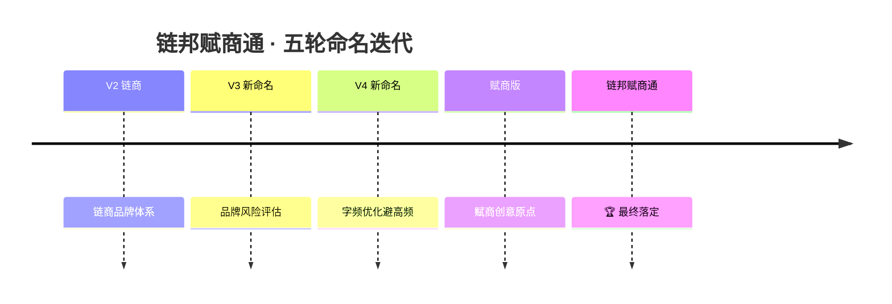

# 品牌命名演进史

## 演进时间线

## 各版本要点

### V2 — 链商品牌体系（20260605前）
- 品牌名：链商
- 定位：连锁商业联盟
- 问题：商标风险、品类模糊

### V3 — 品牌风险评估 + 新命名（20260610）
- 识别"链商"商标风险
- 三套方案：近商联 / 店营通 / 商域达
- B端经营定位确立

### V4 — 字频优化版（20260612）
- 基于第35/42/9类商标高频字分析
- 完全避开"商/通/联/汇/智/云/达"高频字
- 三套方案：赋业初 / 砚璞启 / 耕赋源

### 赋商创意方案（20260611）
- "赋商"为核心创意原点
- 赋能商业 · 赋予商家能力 · 释放经营天赋
- 三套方案：赋商联 / 赋商通 / 赋商汇

### 🏆 链邦赋商通（20260615最终）
- 链邦 = 连接社区商业生态
- 赋商 = 赋能商家经营能力
- 通 = 全域通达
- 商标第35/42/9类注册中

## 命名方法论

基于6大核心维度和6种本地生活平台命名模型（详见 [[../../references/naming-methodology.md|命名方法论]]）

## 关联

- [[🧠 品牌知识图谱]]
- [[../品牌/链邦赋商通 品牌定位]]
- [[../../20260612 品牌新命名方案_V4/|V4 新命名方案]]
- [[../../20260611 赋商创意命名方案/|赋商创意命名方案]]
