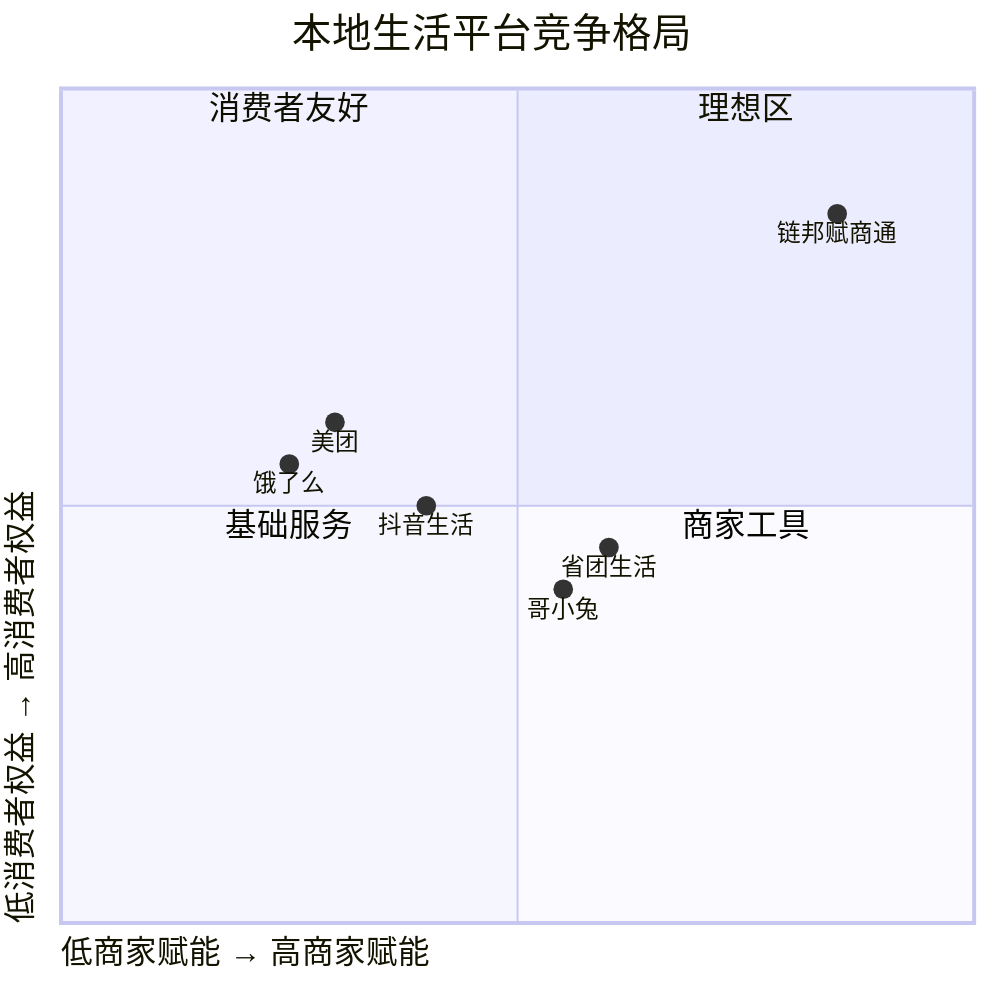

# 竞品雷达

## 竞争格局总览

## 六维对比

| 维度 | 链邦赋商通 | 美团 | 省团生活 | 哥小兔 |
|------|-----------|------|----------|--------|
| 商家赋能 | ⭐⭐⭐⭐⭐ | ⭐⭐⭐ | ⭐⭐⭐⭐ | ⭐⭐⭐⭐ |
| 消费者权益 | ⭐⭐⭐⭐⭐ | ⭐⭐⭐ | ⭐⭐⭐ | ⭐⭐⭐ |
| 推广激励 | ⭐⭐⭐⭐⭐ | ⭐⭐ | ⭐⭐⭐⭐ | ⭐⭐⭐⭐ |
| 技术平台 | ⭐⭐⭐⭐ | ⭐⭐⭐⭐⭐ | ⭐⭐⭐ | ⭐⭐⭐ |
| 合规程度 | ⭐⭐⭐⭐⭐ | ⭐⭐⭐⭐⭐ | ⭐⭐⭐ | ⭐⭐⭐ |
| 品牌认知 | ⭐⭐ | ⭐⭐⭐⭐⭐ | ⭐⭐⭐ | ⭐⭐⭐ |

## 链邦赋商通 差异化优势

1. **全平台权益互通** — 独家能力，竞品不具备
2. **千面千店** — 三类商家差异化呈现
3. **交易即结算** — 零固定费用
4. **三级推广网络** — 城市服务商→服务站→推广者
5. **100%合规架构** — 汇付托管、无资金池

## 详细竞品资料

- [[../../20260610 哥小兔 × 省团生活 深度竞品研究报告/|哥小兔 × 省团生活 深度报告]]
- [[../../20260522 本地生活赛道对比分析/|本地生活赛道对比]]
- [[../../references/competitor-profiles.md|竞品档案]]

## 关联

- [[🧠 品牌知识图谱]]
- [[📋 项目索引]]
