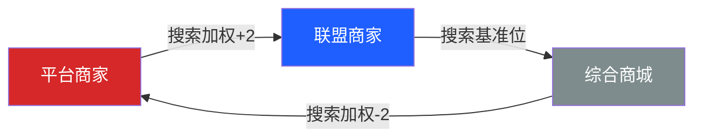
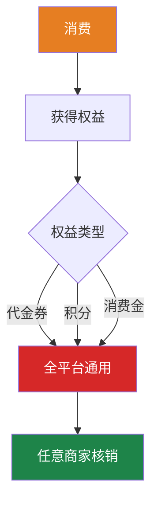
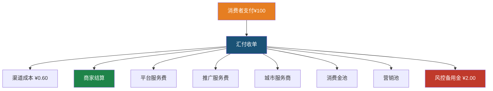
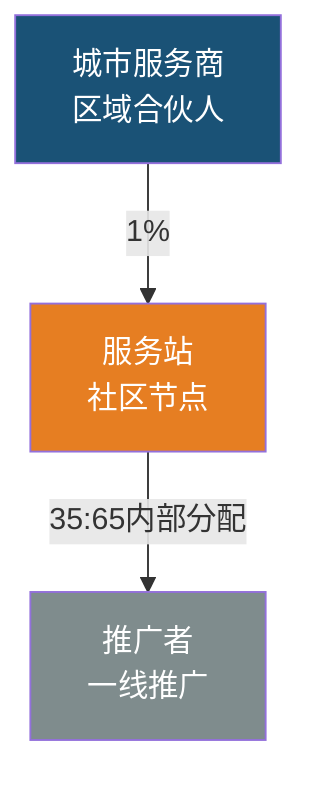
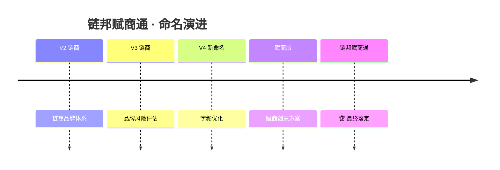

# 🧠 链邦赋商通 · 品牌知识图谱

## 中心节点：链邦赋商通

> **面向社区商业的数字经营平台**
> 三大目标：帮商家提升复购率 · 帮用户获得持续消费权益 · 帮社区形成可持续商业循环

---

## 两大体系

### 1. 消费流转体系
平台商家 → 联盟商家 → 综合商城（软性优先级引导）

### 2. 全生态会员权益互通体系
消费者在任一商家获得权益 → 全平台任意商家使用

---

## 三大业态

| 业态 | 布局 | 搜索权重 | 标识 |
|------|------|----------|------|
| **平台商家** | Premium | +2 | 品牌认证蓝标 |
| **联盟商家** | Standard | 基准 | 社区好店绿标 |
| **综合商城** | Minimal | -2 | 平台自营灰标 |

## 三方价值

| 角色 | 核心价值 | 关键机制 |
|------|----------|----------|
| 消费者 | 持续消费权益 | 三元营销FABE |
| 商家 | 提升复购率 | 千面千店+会员互通 |
| 推广者 | 推广服务费 | 三级管理网络 |

---

## 服务费结算模型 V3.2

---

## 三元营销 FABE

| 工具 | 发放比例 | 抵扣上限 | 有效期 | 通用性 |
|------|----------|----------|--------|--------|
| 代金券 | 5% | 30% | 90天 | 全平台 |
| 积分 | 1:100 | 20% | 2年 | 全平台 |
| 消费金 | - | 30% | 12月 | 全平台 |

---

## 三级管理体系

---

## 合规三条红线

1. 🔴 **积分不可兑现**
2. 🔴 **不可形成资金池**
3. 🔴 **不可承诺收益**

详见 [[合规红线与术语表]]

---

## 品牌命名演进

详见 [[品牌命名演进史]]

---

## 关联

- [[🏠 首页]]
- [[📋 项目索引]]
- [[CLAUDE.md]]
- [[references/model-evolution.md]]
- [[references/compliance-full.md]]
